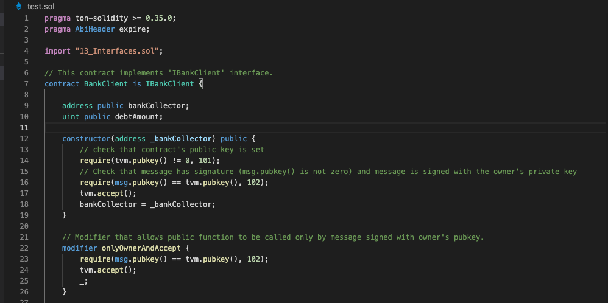

   

# VSCode TON-Solidity syntax highlighter

This is a simple and lightweight syntax highlighting extension for VSCode.

## Features

- syntax highlighting

  - keywords
  - variables
    -literals
  - comments
  - specification Free TON

- code completion
  - keywords
  - variable names
  - classes names
  - method names
  - interfaces

Additionally:
TON Crystal theme in dark and light styles

## License

This project is made available under the MIT License (MIT)
